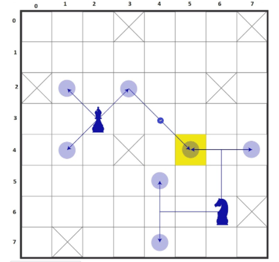

### **_Screenshot Of Problem Statement_**



[comment]: <> (![]&#40;https://i.pinimg.com/originals/0e/a8/80/0ea8809418106e20bc43ea5cd43ca4fa.gif&#41;)
## Problem Statement 
```
We have an NxM grid there are two animals one is 'Horse' and another is 'Bishop' which has different moving abilities. A 'Horse' can move 2.5 steps and a 'Bishop'
can move only diagonal but not horizontally or vertically. Some grids are marked as inactive. Return 1 position where these animals can meet at any point.
In the following image 0,3 & 2,0 are represented as an inactive grid where none of the animals can visit and 'Bishop' is at 3,2 position and possible
direction are represented as arrow and 'Horse' is available at 6,6 and possible direction where horse can move are represented as arrow and circles. One of the possible point 
where the Bishop and Horse can meet is 4,5 as represented by yellow color. You need to use your own data structure,
data types and test cases asper the requirement. 

Hint: (Hint: use graph algorithm - BFS) *
```


### **Contact me :** [Rakesh YAdav](https://www.linkedin.com/in/rakeshyadav01/)


